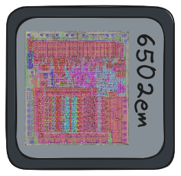

<p align="center">
    
</p>

An emulator for processor 6502 in beautiful C.

# Usage

```console
# build and run existing example 1
$ chmod +x build.sh
$ ./build.sh

# alternatively make binary and provide file_name
$ make 
$ ./a.out file_name

# or to run existing examples
$ make eg1
$ make eg2
```

